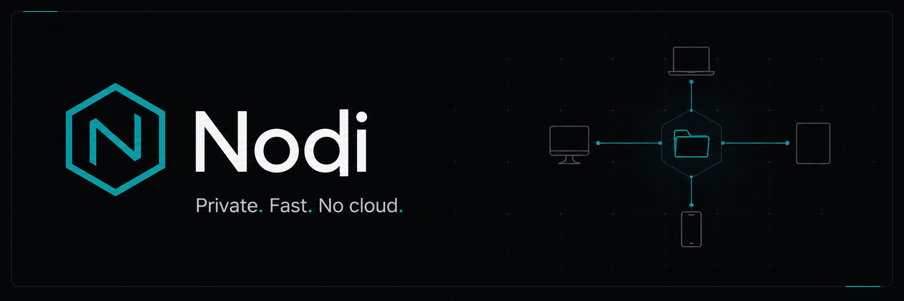

<p align="center">
  
</p>

<p align="center">
  A lightweight, self-hosted web file manager for your home network.
</p>

<p align="center">
  <a href="https://github.com/Twarga/Nodi/actions/workflows/docker-publish.yml">
    
  </a>
  
  
  
  
</p>

---

## What it is

Nodi is a personal file hub for moving files between your own devices — laptop, phone, tablet, TV — over your home LAN. It is NOT a collaboration suite. Think of it as a private Dropbox that lives on your own hardware.

**Core workflow:**
1. Log in securely with a bcrypt-hashed password
2. Browse folders with zero-latency SPA navigation
3. Upload large files with resumable chunked transfers (20 GB–100 GB+)
4. Preview images, video, audio, PDF, and text files
5. Share read-only links or upload dropboxes on your trusted network
6. Mount storage via WebDAV from desktop and mobile file managers

---

## Quick Start

### Option A: One-Click Installer (Docker or Direct)

Run the installer on any Linux server. It will ask you to choose **Docker** or **Direct** install, and set your own admin username and password.

```bash
bash <(curl -fsSL https://raw.githubusercontent.com/Twarga/Nodi/main/install.sh)
```

The installer:
- Clones the latest source
- Lets you choose Docker or native (no containers)
- Asks for your admin username and password
- Generates a secure cookie secret automatically
- Starts Nodi on port **7319**
- Registers a **systemd** service so it auto-starts on boot

**Custom install directory:**

```bash
INSTALL_DIR=/opt/nodi bash <(curl -fsSL https://raw.githubusercontent.com/Twarga/Nodi/main/install.sh)
```

**After install:**

```bash
sudo systemctl status nodi   # check status
sudo systemctl stop nodi     # stop
sudo systemctl restart nodi  # restart
```

### Option B: Docker Compose

```bash
cp .env.example nodi.env
# Edit nodi.env and set QL_BOOTSTRAP_PASSWORD or QL_PASS_HASH
docker compose up -d
```

### Option C: Local Development

```bash
./run.sh
```

Requires Go 1.24+ and Node.js 20+.

**`run.sh` options:**

```bash
./run.sh --no-build    # skip frontend build
./run.sh --test        # run tests, no server start
./run.sh --reset       # wipe nodi_files and .env for clean start
./run.sh --bg          # start in background
./run.sh --stop        # kill background process
```

---

## Uninstall

To completely remove Nodi:

```bash
bash <(curl -fsSL https://raw.githubusercontent.com/Twarga/Nodi/main/uninstall.sh)
```

This removes the systemd service, Docker containers/volumes, source code, and optionally all user data. You can also run it locally:

```bash
./uninstall.sh
```

Set `REMOVE_DATA=yes` to also delete uploaded files:

```bash
REMOVE_DATA=yes ./uninstall.sh
```

---

## Tech Stack

- **Backend:** Go 1.24+ (standard library + `http.ServeMux`)
- **Frontend:** Preact + Signals
- **Styling:** Tailwind CSS v4
- **Build:** Vite
- **Packaging:** Multi-stage Docker build + GitHub Container Registry
- **Deployment:** Docker Compose, Kubernetes manifests included

---

## Security

- Passwords hashed with bcrypt (never stored plain)
- Session cookies are signed HMAC tokens with sliding expiry
- CSRF protection with per-session tokens
- Share links use unguessable hashed tokens (never in URLs)
- Request body limits on all JSON endpoints
- Rate-limited login attempts
- Unsafe default secrets are rejected at startup

**Important:** Nodi is safest as a **LAN-only** app. If you expose it remotely, put it behind HTTPS and a firewall you understand.

---

## Features

| Feature | Status |
|---------|--------|
| Large-file uploads (stream to disk) | ✅ |
| Resumable chunked uploads | ✅ |
| Folder upload with structure preserved | ✅ |
| Mobile-friendly upload screen (Send) | ✅ |
| Image / video / audio / PDF / text preview | ✅ |
| Search across storage | ✅ |
| Share links (read-only & upload dropbox) | ✅ |
| Password-protected shares | ✅ |
| Expiring share links | ✅ |
| WebDAV endpoint | ✅ |
| Trash & restore | ✅ |
| Streaming TAR backup | ✅ |
| Dark / Light / System theme | ✅ |
| PWA support | ✅ |
| Keyboard shortcuts | ✅ |
| Drag-and-drop upload | ✅ |
| Bulk actions (move, copy, delete, compress) | ✅ |

---

## Kubernetes

Pre-built manifests are in `deploy/kubernetes/`.

```bash
cd deploy/kubernetes
# Create a secret with your credentials first
kubectl apply -k .
```

The Kubernetes deployment uses the `ghcr.io/twarga/nodi:latest` image with readiness and liveness probes on `/api/health`.

See [`deploy/kubernetes/README.md`](./deploy/kubernetes/README.md) for details.

---

## License

MIT License. Created by [Twarga](https://github.com/Twarga).
