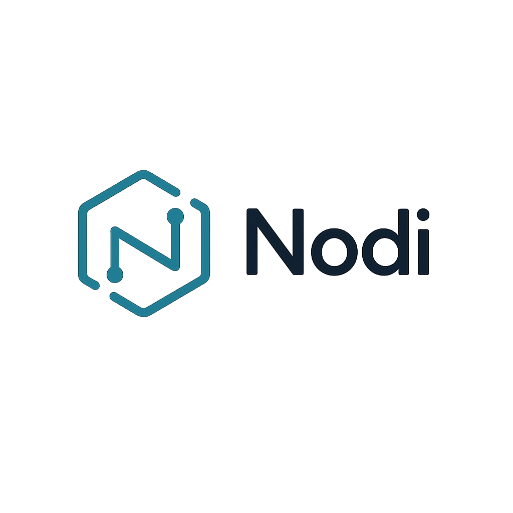

# Nodi

<p align="center">
  
</p>

<p align="center">
  A lightweight, self-hosted web file manager built for speed, security, and a quiet technical aesthetic.
</p>

<p align="center">
  
  
  
  
  
</p>

## What it is

Nodi is a minimalist file management solution for users who value density and performance. It serves as a private cloud alternative that runs directly on your hardware, providing a monastic interface for interacting with your local files.

## Core workflow

1. Authenticate securely via BCrypt-backed login
2. Browse directories with zero-latency SPA navigation
3. Manage assets with async Rename, Create, and Delete actions
4. Track large uploads with real-time UI progress bars
5. Toggle between Light and Dark modes instantly

## Tech stack

- **Backend**: Go (standard library + `http.ServeMux`)
- **Frontend**: Vanilla JavaScript (ES Modules)
- **Styling**: Tailwind CSS v3
- **Packaging**: Multi-stage Docker build
- **OS**: Alpine Linux

## Status

**MVP deployment ready.** The core self-hosted file manager flow is covered by Go integration tests: login, dashboard, static assets, browse, create folder, upload, download, rename, delete, and root-escape rejection.

## Deployment (Fast Install)

Run the one-click installer on any Linux server with Docker installed. It **always builds from the latest source** — no old images.

```bash
curl -fsSL https://raw.githubusercontent.com/Twarga/Nodi/main/install.sh | bash
```

The installer clones the repo, builds a fresh Docker image, and starts Nodi. Default credentials are `admin / admin`; change these in `nodi.env` before exposing outside a trusted network.

**Custom port or directory:**

```bash
curl -fsSL https://raw.githubusercontent.com/Twarga/Nodi/main/install.sh | NODI_PORT=9090 INSTALL_DIR=/opt/nodi bash
```

## Docker

Run from a clone:

```bash
cp .env.example nodi.env
docker compose up -d
```

The compose file uses a named `nodi-files` volume mounted at `/nodi_files`.

## Development

Prerequisites:
- [Go 1.24+](https://go.dev/)
- [Docker](https://www.docker.com/) (optional)

## Quick Start (Local)

Run the full app with one command:

```bash
./run.sh
```

This installs frontend dependencies, builds the UI, scaffolds a default `.env`, and starts the Go server.

**Requires:** Go 1.24+, Node.js 20+, npm

Default credentials: `admin` / `admin` — change these before exposing to a network.

## License
MIT License. Created by [Twarga](https://github.com/Twarga).
